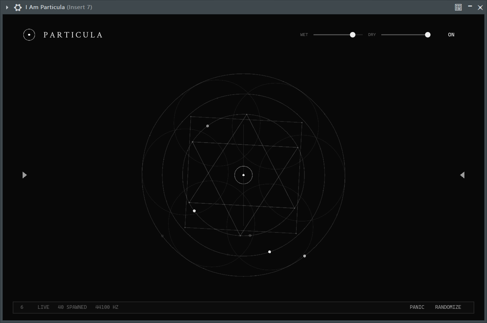

# Particula



一个实验性的粒子效果器，基于 [i_am_dsp](https://github.com/IAMMRGODIE/i_am_dsp), 支持 CLAP 格式.

## 基本想法

维护一个 `history: RingBuffer<f32>`，每隔一段时间发射一个“粒子”. 粒子实际上是一个播放头，读取 history 对应的位置然后输出。
播放头的位置可以不固定，每个粒子播放的音频可以被处理（用 WSOLA 变调拉伸，用 IIR Hilbert Transform 频移，还有控制音量 balabala）. 
粒子有生命周期，过一段时间会自己消失。
粒子的输出也可以写回 history，作为下一个粒子的输入。
一堆这样的 feedback 就可以做出神奇的声音了。

更详细的可以去看 AI 写的 [Architecture.md](Architecture.md)。

## 编译

为了开发方便，在 `Cargo.toml` 里面 `i_am_dsp` 相关的依赖都是填的路径，所以在编译的时候需要先手动改一下.

### 构建 CLAP

```bash
cargo build --release -p particula_plugin
cp target/release/particula_plugin.dll target/release/Particula.clap
# 把 Particula.clap 放进 DAW 的 CLAP 插件目录即可
```

### Standalone（不依赖 DAW）

```bash
# 用于测试 UI
cargo run --release -p particula_plugin --example standalone
```

### 无头探针（验证 wet 通路）

```bash
cargo run --release -p particula_plugin --example clap_probe -- target/release/Particula.clap
```

## 测试

```bash
cargo test                         # 全套行为测试（spawn 节律/反馈/PANIC/BPM…）
cargo test --release --test high_density -- --nocapture
                                            # 高密度基准：128→0.39x / 256→0.50x / 384→0.51x
                                            # （相对实时负载，release、48 kHz、2 s 音频）
cargo clippy -p particula -p particula_plugin --all-targets   # 保持零警告
```

## 许可证

MPL-2.0

另：[Crimson Text](https://github.com/skosch/Crimson) 衬线字体为 OFL 开源许可，随包分发。
